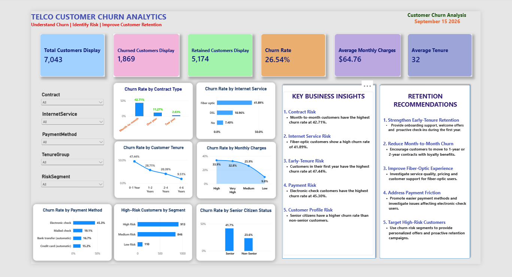

# 📊 Telco Customer Churn Analytics

## 📌 Project Overview

This project analyzes customer churn in a telecommunications company to identify the key factors contributing to customer attrition.

The analysis combines **Excel, SQL, Python, and Power BI** to transform raw customer data into actionable business insights and an interactive executive dashboard.

The main business question is:

> **Why are customers leaving, which customer segments are most at risk, and what actions can the business take to reduce churn?**

---

## 🎯 Business Objectives

* Analyze the overall customer churn rate.
* Identify customer segments with high churn.
* Understand the relationship between contract type and churn.
* Analyze tenure and monthly charges.
* Identify services associated with higher churn.
* Compare customer demographics and churn behavior.
* Develop actionable recommendations to improve customer retention.
* Build an interactive Power BI dashboard for decision-making.

---

## 🛠️ Tools & Technologies

| Tool        | Purpose                                     |
| ----------- | ------------------------------------------- |
| 📊 Excel    | Data cleaning, analysis and calculations    |
| 🗄️ MySQL   | Data querying and business analysis         |
| 🐍 Python   | Exploratory Data Analysis and visualization |
| 📈 Power BI | Interactive dashboard and data storytelling |
| 📝 GitHub   | Project documentation and portfolio         |

### Python Libraries

* Pandas
* NumPy
* Matplotlib
* Seaborn

---

## 📂 Project Workflow

```text
Raw Dataset
     ↓
Excel Data Cleaning & Analysis
     ↓
SQL Data Analysis
     ↓
Python Exploratory Data Analysis
     ↓
Power BI Dashboard
     ↓
Business Insights & Recommendations
```

---

## 📈 Key Performance Indicators

| KPI                        |    Result |
| -------------------------- | --------: |
| 👥 Total Customers         |     7,043 |
| 🔴 Customers Churned       |     1,869 |
| 🟢 Customers Retained      |     5,174 |
| 📉 Churn Rate              |    26.54% |
| 💰 Average Monthly Charges |    $64.76 |
| 📅 Average Tenure          | 32 months |

---

## 🔍 Key Analysis Areas

### Customer Churn

Analyzed overall churn levels and identified patterns between customers who stayed and customers who left.

### Contract Analysis

Compared churn behavior across different contract types to identify higher-risk customer groups.

### Tenure Analysis

Analyzed customer tenure to understand whether newer customers are more likely to churn.

### Monthly Charges

Investigated the relationship between monthly charges and customer churn.

### Customer Services

Examined customer service subscriptions and their relationship with churn behavior.

### Customer Demographics

Analyzed demographic characteristics to identify differences in churn behavior across customer groups.

---

## 💡 Business Insights

The analysis helps identify:

* Customer segments with elevated churn risk.
* Contract types associated with higher customer attrition.
* The relationship between customer tenure and churn.
* The impact of monthly charges on customer retention.
* Service combinations associated with increased churn.
* Customer groups that may require targeted retention strategies.

---

## 📊 Power BI Dashboard

The Power BI dashboard provides an interactive view of customer churn using KPIs, charts, and filters.

### Dashboard Preview



The dashboard allows users to explore churn by different customer characteristics and business dimensions.

---

## 📁 Repository Structure

```text
Telco-Customer-Churn-Analytics/
│
├── Dataset/
│   └── Telco_Customer_Churn.csv
│
├── Excel/
│   └── Telco_Customer_Churn_Analysis.xlsx
│
├── SQL/
│   ├── database_setup.sql
│   ├── data_cleaning.sql
│   └── business_analysis.sql
│
├── Python/
│   ├── Telco_Customer_Churn_Analysis.ipynb
│   └── requirements.txt
│
├── PowerBI/
│   └── Telco_Customer_Churn_Analytics.pbix
│
├── Screenshots/
│   └── dashboard.png
│
└── README.md
```

---

## 🎯 Business Recommendations

Based on the analysis, the business can focus on:

1. **Targeting high-risk customer segments** with personalized retention campaigns.
2. **Improving early-tenure customer retention** through stronger onboarding and engagement.
3. **Reviewing pricing and monthly charges** for customers showing elevated churn risk.
4. **Promoting longer-term contracts** where appropriate to improve customer retention.
5. **Using churn-risk analysis** to proactively contact customers before they leave.

---

## 💼 Skills Demonstrated

### Data Analytics

* Data cleaning
* Exploratory Data Analysis
* KPI analysis
* Customer segmentation
* Business analysis
* Data storytelling

### Technical Skills

* Microsoft Excel
* MySQL
* Python
* Pandas
* NumPy
* Matplotlib
* Seaborn
* Power BI
* DAX
* GitHub

### Business Skills

* Problem solving
* Insight generation
* Root-cause analysis
* Data-driven recommendations
* Dashboard design
* Business communication

---

## 👤 Author

**Mekala Sanjana**

Aspiring Data Analyst | Excel | SQL | Python | Power BI

---

⭐ If you find this project useful, feel free to explore the analysis files and dashboard.
